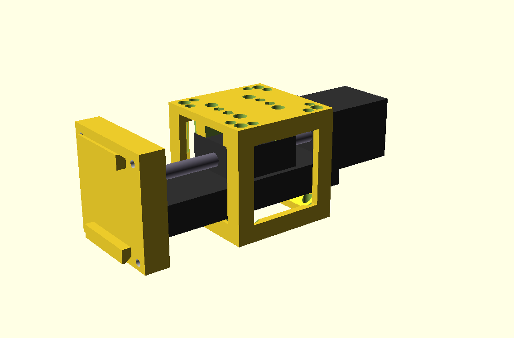

# 3D design for the autofocus component

The autofocus module is based on the small linear slider found, among other, on Amazon ([French site](https://www.amazon.fr/dp/B08Y6VZMC8?ref=ppx_yo2ov_dt_b_product_details&th=1), [US site](https://www.amazon.com/s?k=Linear+Rail+50mm+nema11&crid=AHAYTX9E18IR&sprefix=linear+rail+50mm+nema%2Caps%2C635&ref=nb_sb_noss)).

On the front side, the sample holder snaps onto the front panel of the slider thanks to four spheric magnets. The sample itself is held using a simple rubber band.

The current 3D design uses [OpenScad](https://openscad.org/).

The module uses two limit switches to detect the start and end position of the linear slider. The switches are the [Omron D2F-01L-D3](https://omronfs.omron.com/en_US/ecb/products/pdf/en-d2f.pdf).

The main files are:

* FocusMicroscope.scad: The main file that bundles the different components together.
* Structure.scad: The components of the focus module.
* LinearSlider.scad: 3D model of the linear slider.
* UC2.scad: A 3D model of the UC2 cube.

## Bill of materials

| Quantity | Description |
|----------|-------------|
| 1 | [Linear slider](https://www.amazon.com/s?k=Linear+Rail+50mm+nema11&crid=AHAYTX9E18IR&sprefix=linear+rail+50mm+nema%2Caps%2C635&ref=nb_sb_noss) (50 mm or 100 mm, NEMA11 stepper motor) |
| 2 | M2 x xx mm screws  |
| 2 | M2 nuts |
| 4 | M3 x xx mm screws |
| 2 | M3 x xx mm screws |
| 4 | Spheric magnets, 5 mm |
| 2 | [Omron D2F-01L-D3](https://omronfs.omron.com/en_US/ecb/products/pdf/en-d2f.pdf) |
| - | Wire for the limit switches |

