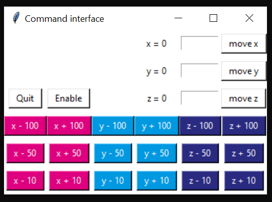

# CSL-stage
__keywords__: Stepper motors, Arduino, Python, Freecad, 3D printing

The goal of this module is to provide simple tools to control a motor to automate manual tasks.

An Arduino is used to control the stepper motors with motor shields. The motors are controllable: 
- via Arduino through the serial interface
- with a Python library that communicates serially with the Arduino
- with a user-friendly Tkinter interface based on the Python library
  
The use of limit-switches is integrated and is preferred for safety and reproducibility. 


## Pre-requisites

- Install RomiSerial and the Arduino software XXXX
- The stepper motor(s) and motor shield(s) are readily available. Refer to the example gallery for ideas. 
- The code was tested on Windows and Linux


## Hardware :gear:
Check-out the example gallery and the description of how to implement them: turning a manual stage in a motorized one, building a microscope focus module, increasing the displacement range of a piezo-motor, etc. 

| Component|      Quantity      |  Price per unit | Example|  
|----------|:-------------:|------:|------:|  
| Arduino Uno |    1   |   24€ | [Robotshop](https://www.robotshop.com/eu/fr/microcontroleur-arduino-uno-r3-usb.html)|  
|Stepper motor | tested up to 3 | |
| Stepper driver | | |
| Wires | | |


## Software :desktop_computer:

| Software | Version we used | Download |
|----------|:-------------:|:-------------:|  
| Arduino | 1.8.13 | [download](https://www.arduino.cc/en/software)
| Python  | 3.7 |[install](https://github.com/Alienor134/Teaching/blob/master/Python/Installing_Anaconda_creating_environment.md)
| CSL-serial | 1.0 | [install](XXX)


## Codes and files provided :chart_with_upwards_trend:

An [Arduino code](Oquam/Oquam.ino) is provided to control the motors. An extra layer is added in Python to conntrol it easily.
[CSLstage](CSLstage/CSLstage.py) is a class that can be used the following way:


```python
from serial import Serial
from CSLstage import ControlStage

arduino_port = "COM6"

stage = ControlStage(arduino_port, [1,1,1]) #gearbox ratio of X, Y and Z axis
stage.handle_enable(1)
stage.move_dx(10)
stage.handle_enable(0)
stage.close() 
```


# Instructions

## Arduino and Python codes  

First install Arduino IDE and Python 3.7 (links in the **Software** section)  
Second download this repository. We will call the address where you save it "path/to/repo" (for example "C://User/Me/MyRepos").

Open the [Oquam/Oquam.ino](Oquam/Oquam.ino) file. 
Open it with Arduino IDE software by double clicking on the file **Oquam.ino** and upload the codes on the Arduino by clicking on the arrow. If it fails make sure that you are correctly connected to the Arduino: check the card type and the COM port in the "Tools" ("Outils" on the image). 

<p align="center">

</p>


To make the interaction user-friendly, we developed a code that sends instructions to the Arduino through the Serial port. It requires Python. If you already use Python for other projects, you will want to keep this code isolated from your current install. This is possible with a virtual environment. Open Anaconda Prompt and navigate to the repository

```
cd CSL-stage
python setup.py develop
```

You can launch the interface 

```
from CSLstage import ControlStage
from CSLstage import interface_motors

stage = ControlStage("COM6", [1,1,1])
interface_motors(stage)
```
Press the buttons to move by predefined values, or enter manually a value and press the "move" button. The values correspond to motor steps.


<p align="center">

</p>


Note: You will have to determine the backlash of each of your motors: the number of steps you have to turn before the platform moves when you change directions. You will find 4 backlash values, one per direction per motor. We found backlash values between 7 and 12 steps. 


## Examples"

### Photos


</img> 
</img> 
</img> </img> 

### How to reproduce: 

https://github.com/SonyCSLParis/Motorized-stage/tree/main/XY-stage  
https://github.com/SonyCSLParis/Motorized-stage/tree/main/Z-stage  
https://github.com/openUC2/UC2-Motorized-XY-Table  


## License

This project is licensed under the [GNU General Public License v3.0](https://tldrlegal.com/license/gnu-general-public-license-v3-(gpl-3))

