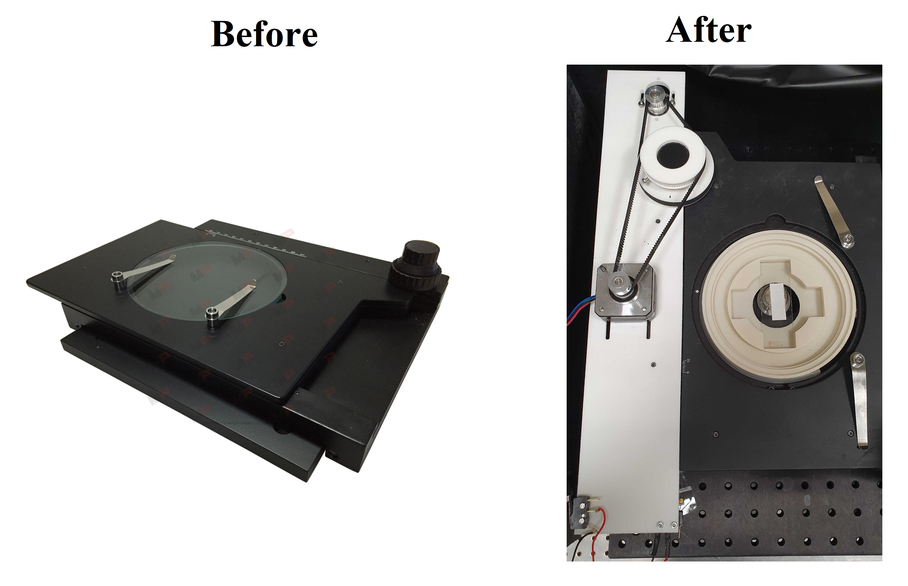
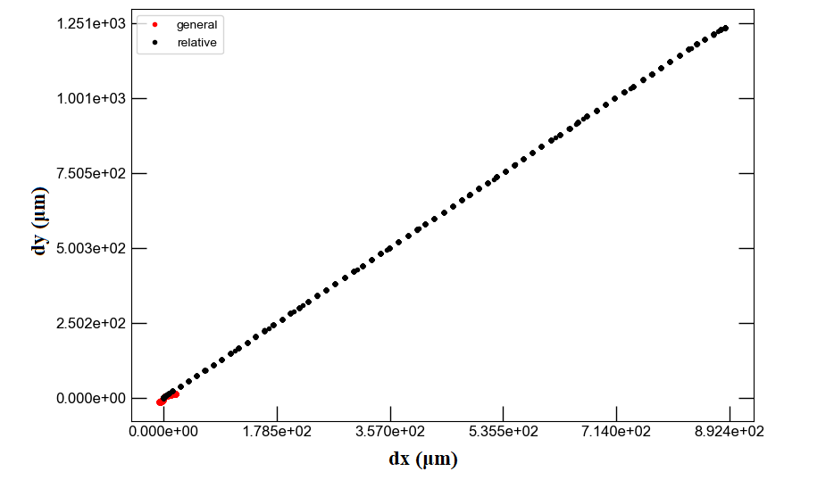
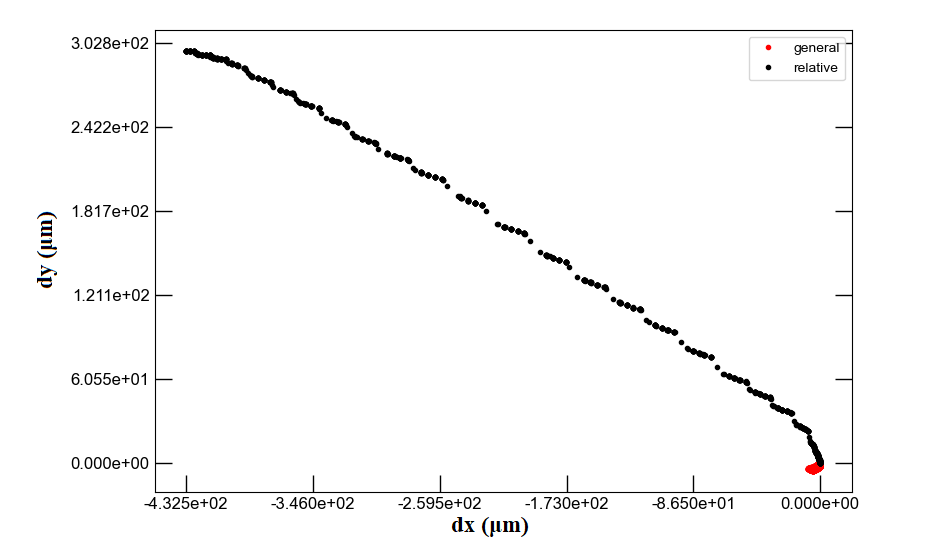
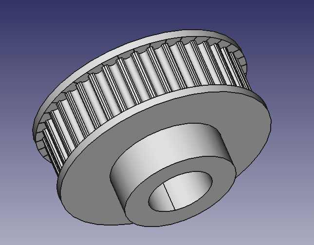
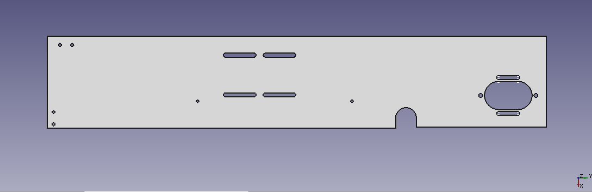
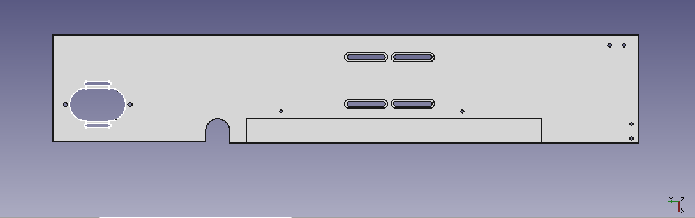
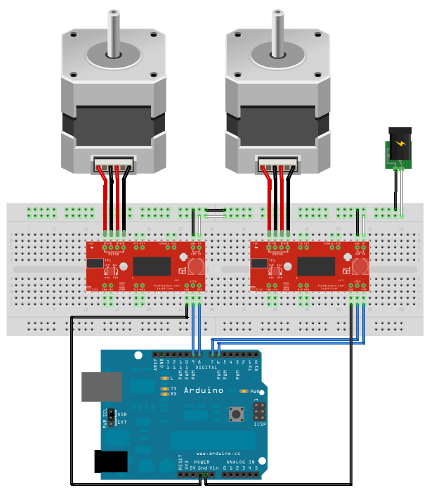
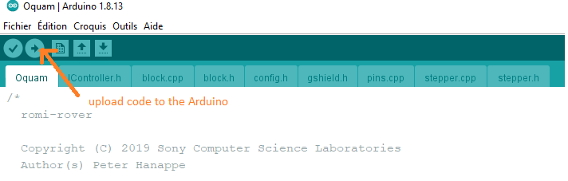

# Automation of a manual microscope stage
__keywords__: Stepper motors, Arduino, Python, Freecad, 3D printing


The goal of this project is to convert a manual microscope stage into a motorized one.   
We control the motorized stage via Python and provide a user-friendly interface as well as the 3D models for the parts we replaced.
The precision of displacement approaches the micrometer.   
We added precisions for the budget. The maximum budget if you buy the manual stage and go through a supplier for the 3D-printing is 500€.

<p align="center">

</p>


# Method

The knobs initially used to manually move the platform are linked to motors via 2 belt-pulley systems (X and Y displacements). One removable part of the platform is replaced by a 3D-printed part that allows to fix the two motors. The pulleys are also 3D-printed to fit on the knobs. 

An Arduino is used to control the two stepper motors with two motor shields. The motors are controllable
-  via Arduino through the serial interface
- with a Python library that communicates serially with the Arduino
- with a user-friendly Tkinter interface based on the Python library

# Bill of materials

## Hardware :gear:
We used what we had in our drawers, it may be possible to reduce the costs by changing some of the equipment. 

| Component|      Quantity      |  Price per unit | Example|  
|----------|:-------------:|------:|------:|  
| Manual XY stage |  1 | 245€ | [Amazon](https://www.manualpositioning.com/e_products_show/?id=45)|  
| Arduino Uno |    1   |   24€ | [Robotshop](https://www.robotshop.com/eu/fr/microcontroleur-arduino-uno-r3-usb.html)|  
| Stepper driver | 2 |    10€ | [Robotshop](https://www.robotshop.com/eu/fr/controleur-moteur-pas-easydriver.html?gclid=EAIaIQobChMIhLiChaj58QIVxQwGAB1bUgYvEAQYASABEgIi8vD_BwE) |  
| Stepper motor  (0.9 °/s, 11 N/cm)  |1 | 11€ | [17HM08-1204S](https://www.omc-stepperonline.com/fr/nema-17-bipolaire-0-9deg-11ncm-15-6oz-in-1-2a-3-6v-42x42x21mm-4-fils.html)|  
| Stepper motor with gearbox| 1| 73€ |[42STH38-100](https://www.gotronic.fr/art-moteur-42sth38-100-18839.htm)|  
| Motor belt GT2 |2 |1€|[Phidgets](https://www.phidgets.com/?tier=2&catid=42&pcid=35) |
| Motor pulley 20 teeth/5mm bore |2 | 1€ |[Phidgets](https://www.phidgets.com/?tier=2&catid=42&pcid=35) | |
| Connection wires | | |  
| Screws M2, M3 | | |  
| 3D printer |

Websites where you can buy the hardware: Motedis, Phidgets, Robotshop, rs-online, RepRap

If you don't own a 3D printer you can use the platform [Sculpteo](https://www.sculpteo.com). Average delivery time: 2 weeks, possibility to pay for faster delivery. [Example of order](images/sculpteo_order.png).


## Software :desktop_computer:
Only open-source softwares

| Software | Version we used | Download |
|----------|:-------------:|:-------------:|  
| Freecad | 0.19 |  [download](https://wiki.freecadweb.org/Download)
| Arduino | 1.8.13 | [download](https://www.arduino.cc/en/software)
| Python  | 3.7 |[install](https://github.com/Alienor134/Teaching/blob/master/Python/Installing_Anaconda_creating_environment.md)


## Codes and files provided :chart_with_upwards_trend:

### 3D designs: 
- [scalable pulley Freecad](3D_models/large_button.FCStd) (modified from [manueaswn's scalable pulley](https://www.thingiverse.com/thing:3875983) )
- [small button pulley](3D_models/large_button_100t.stl)  
- [large button pulley](3D_models/medium_button_80t.stl)
- [plate element](3D_models/plaque_moteur_gearbox.stl)

### Control of motors by Arduino 
- [libromi](https://github.com/romi/libromi/tree/c6992f0516e695cd28e09cd8dcbb921d4bc2097d) (written for the [Romi Project](https://github.com/romi/libromi))
- [interface](codes/launch_interface.py)


# Results

In the end we were able to control the movement of the stage to go from one trap to the following one. The following animation shows a trap and its neighbour appearing one after the other in the center of the camera.

<p align="center">

</p>

<p align="center">
Credits: Léa Pinon and Jacques Fattacioli for the microfluidic set-up (ENS, IPGG), Thomas Le Saux and Aliénor Lahlou for the imaging set-up (ENS, Sony CSL)
</p>  


By using the EasyDriver we could rotate each motor by one microstep. In the end the set-up enabled us to reach a minimal movement of 1,95 μm along the **x** axis and of 0,05 μm along the **y** axis.

In order to estimate the quality of our set-up, we measured its precision using the registration method which calculates the spatial correlation between two successive images.

On the one hand the analyses of these results shows that the stage moves linearly along the **y** axis as expected. We concluded that our set-up was of good quality for this direction.

<p align="center">

</p>

On the other hand we discovered that the movement along the **x** axis is flawed. Indeed when moving the stage along this axis we regularly measure a small unwanted movement along the **y** axis. This shortcoming leads to imprecise movement along the **x** axis, and it seems to come from the mechanics of the manual platform.


<p align="center">

</p>

# Set-up

## 3D Printing

### Pulleys

To link the stepper motors to the stage we had to print two slave pulleys - one for each knob. We did that using the free and open-source design and modeling software FreeCAD. We first wanted to design these slave pulleys so that moving the stepper motors by one microstep would move the stage by 5 μm.

We determined that one turn of the **y**-axis knob moves the stage by 4 cm. Knowing that the master pulley has 20 teeth and that with the Nema motors we can split one revolution into 1600 steps, we calculated that the **y**-axis slave pulley needed to have 100 teeth. 

We first tested with a simple Nema 17 motor but the couple was not sufficient to move the platform. Therefore we opted for a Nema coupled with a gearbox with 100:1 ratio, multiplying the couple by 100. This motor moved the platform without any issue. 


<p align="center">

</p>

For the **x**-axis we measured that one turn of the knob moves the stage by 2,5 cm. In the case of the **x** axis the 17HM08-1204S stepper motor has 3200 microsteps per revolution and the master pulley has 20 teeth. Thus we calculated that the **x**-axis slave pulley needed to have 32 teeth. Such a little number of teeth leads to modeling issues.

Thus we decided to design an 80 teeth slave pulley for the **x**-axis knob. This leads to a higher precision : when the stepper motor rotates by 1 microstep, the stage moves by 1,95 μm along the **x** axis (with a simple Nema 17 motor)

### New plate

Because of structural constraints, the stepper motors had to be fixed to the stage. This is why we decided to replace a plate screwed upon the stage by a new one whose 3D template we created by using FreeCAD.

This new plate has attachment points for both stepper motors and for potential switches and can be screwed to the stage.


<p align="center">

</p>

<p align="center">

</p>  

## Assembly

In order to keep things simple we decided to control both stepper motors with one Arduino UNO microcontroller. We still had to use one EasyDriver microcontroller for each stepper motor. We used [Brian Schmalzhaus' example](https://www.schmalzhaus.com/EasyDriver/Examples/EasyDriverExamples.html) running multiple stepper motors. The set-up can be seen in the following diagram. As we wanted precise movements, we enabled microstepping control for both motors by adding connections between the MS1 and MS2 pins and the ground for each EasyDriver microcontroller.


<p align="center">

</p>  

<p align="center">
<a href=https://www.schmalzhaus.com/EasyDriver/Examples/EasyDriverExamples.html>source</a>
</p>  

## Arduino and Python codes  

First install Arduino IDE and Python 3.7 (links in the **Bill of Materials**)  
Second download this repository. We will call the address where you save it "path/to/repo" (for example "C://User/Me/MyRepos").

You need to include the library to your Arduino libraries. Copy the folder 
```
libromi/arduino_libraries/RomiSerial 
```
to your own folder Arduino (usually placed in "Documents")
```
Arduino/libraries/
```

An Arduino code allows to control the 2 motor drivers. Fetch it in the folder libromi:

```
libromi/firmware/Oquam
```
Open it with Arduino IDE software by double clicking on the file **Oquam.ino** and upload the codes on the Arduino by clicking on the arrow. If it fails make sure that you are correctly connected to the Arduino: check the card type and the COM port in the "Tools" ("Outils" on the image). 

<p align="center">

</p>


To make the interaction user-friendly, we developed a code that sends instructions to the Arduino through the Serial port. It requires Python. If you already use Python for other projects, you will want to keep this code isolated from your current install. This is possible with a virtual environment. Open Anaconda Prompt and navigate to the repository

```
conda env create -f environment.yml
```
Now activate the environment:  

```
conda activate motorized-stage
``` 

You can launch the interface 

```
cd path/to/repo (here replace by your own path)
cd Motorized-stage/codes
python launch_interface.py
```
Press the buttons to move by predefined values, or enter manually a value and press the "move" button. The values correspond to motor steps.


<p align="center">

</p>

Note: You will have to determine the backlash of each of your motors: the number of steps you have to turn before the platform moves when you change directions. You will find 4 backlash values, one per direction per motor. We found backlash values between 7 and 12 steps. 

## Thanks

We thank Peter Hanappe for the advices on the mechanical parts and for providing codes to control the motors. We thank Eric Aït-Yahiatène for the 3D-printing. 

## License

This project is licensed under the [GNU General Public License v3.0](https://tldrlegal.com/license/gnu-general-public-license-v3-(gpl-3))

## Contacts
If you have questions you can contact Ali Ruyer-Thompson (ali.ruyer--thompson :email: ens.psl.eu) or Aliénor Lahlou (alienor.lahlou :email: ens.psl.eu)